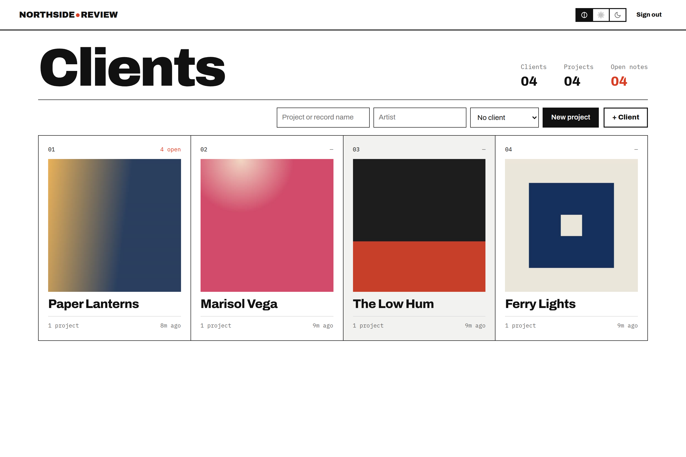
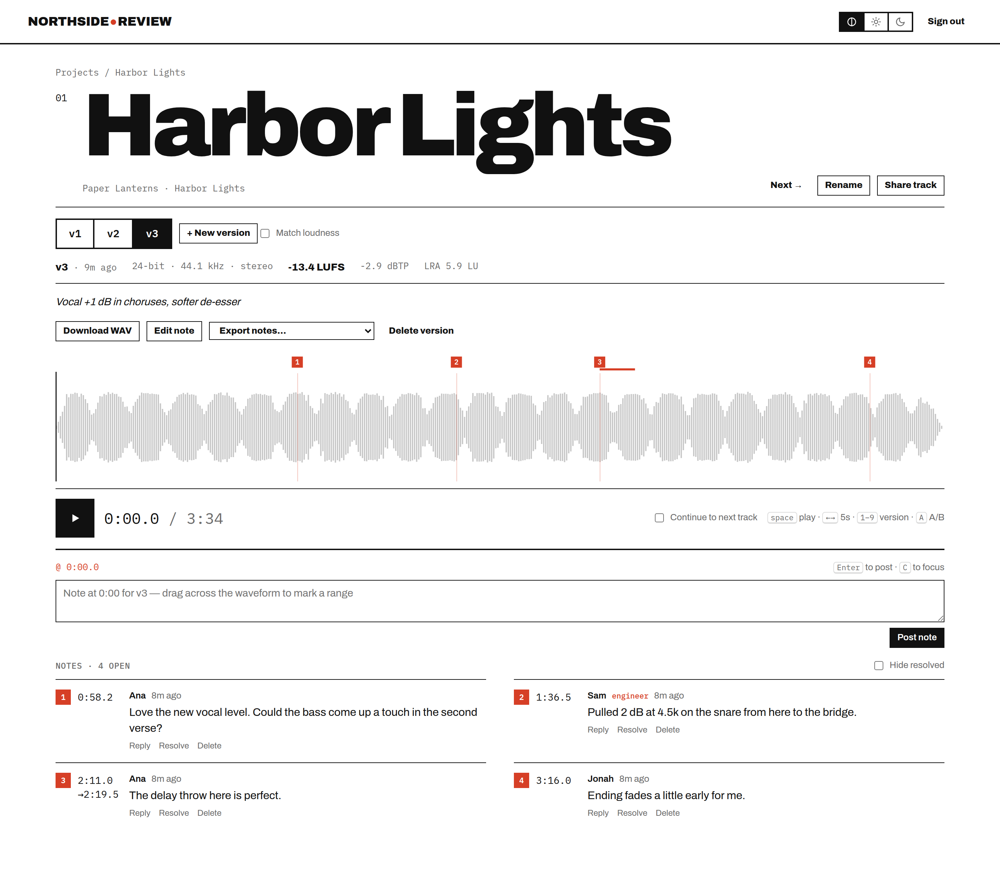
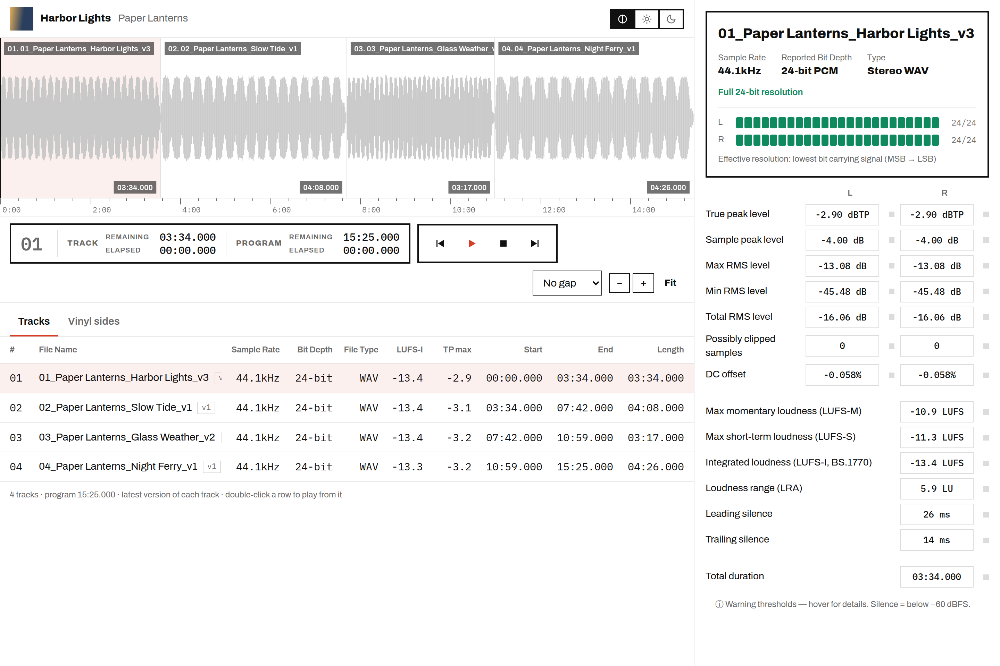
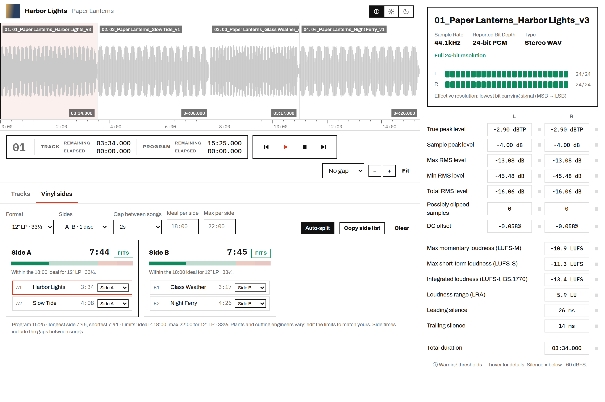
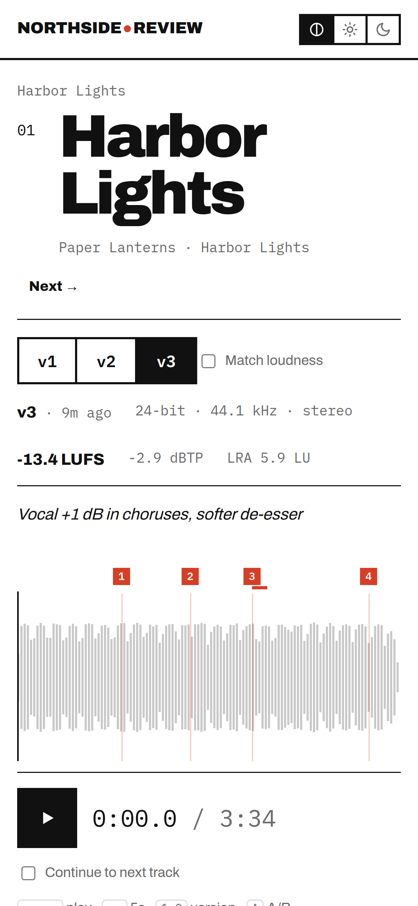

# Studio Review

A private mix-review server for recording, mixing and mastering engineers. You host it yourself. Upload your bounces and send the client a link, and their notes land on the waveform at the exact timecode. It also gives you a mastering QC window and a vinyl side planner.

There are no client accounts and no public sign-up. Only you and the people you send links to can see anything. You pay for a small server (around $6–12 a month) and nothing else.



> **New to servers?** Read **[docs/Studio-Review-Install-Guide.pdf](docs/Studio-Review-Install-Guide.pdf)** instead. It walks through everything step by step, from creating the server to sending your first link, and doesn't assume you've used a terminal before.

---

## Features

**For you**

- **Clients → projects → tracks → versions.** Group projects under a client (band, label, company). Upload `Night Drive_v3.wav` and it becomes version 3 of "Night Drive". `Song - mix 4`, `Song_ver2` and `Song rev5` are recognized too.
- **Album art.** Drag an image onto a project page. The home page shows each client's newest cover.
- **Waveform player with timestamped notes.** Click to seek, or drag across the waveform to mark a range. Press **C** to write a note at the playhead. Notes are numbered on the waveform and support replies and resolve/reopen.
- **A/B between versions.** Switching versions keeps your place. **1–9** jumps to a version and **A** flips back. **Match loudness** levels the versions so the comparison is fair.
- **Loudness on every version.** Integrated LUFS, true peak (dBTP) and LRA, measured on the original file (EBU R128 / BS.1770).
- **Album view (mastering QC).** A pop-out window with the latest version of every track laid end to end. It includes gapless, lossless playback and a per-track QC panel showing true/sample peak, RMS, clipped samples, DC offset, effective bit depth, momentary and short-term loudness, LRA and leading/trailing silence.
- **Vinyl side planner.** Choose 12″/10″/7″ at 33⅓ or 45, then drag songs onto sides A–F or hit **Auto-split**. Each side shows whether it fits the format, and **Copy side list** gives you a cue sheet for the plant.
- **Link activity.** See whether a link was opened, by whom, what they played and what they downloaded. You can get an optional phone push the first time someone opens a link or leaves a note (via the free [ntfy](https://ntfy.sh) app).
- **Note export** as a revision list (.txt), Reaper markers/regions (.csv), an Audacity label track, or a spreadsheet CSV.
- **Watch folder (optional).** Bounce into `<folder>/<Project>/Song_v4.wav` and it imports itself.
- **Light, dark or auto theme.**

**For your clients**

- One link opens a whole project (including tracks you add later) or a single track. Links can have a passcode, an expiry date and a switch for downloading originals, and you can revoke them at any time.
- No account and no app. It works in any browser, including on phones. Clients type their name once and start leaving notes.

Originals are stored untouched. Clients stream a 256 kbps AAC copy and only get the original WAV if you allow downloads on that link.

| | |
|---|---|
|  |  |
| Track page: versions, loudness, numbered notes | Album view: program playback and QC numbers |
|  |  |
| Vinyl sides with fit checks | What your client sees on their phone |

---

## Quick start: try it on your own computer

You need **Node 22.13 or newer** and **ffmpeg**.

```bash
# macOS (with Homebrew); on Linux use your package manager
brew install node ffmpeg

cd studio-review
cp .env.example .env          # then open .env and set ADMIN_PASSWORD
npm install
npm start
```

Open <http://localhost:8080> and sign in with your password. Everything you upload is stored in `./data`.

**Or with Docker** (no Node or ffmpeg install needed):

```bash
cp .env.example .env          # set ADMIN_PASSWORD
docker compose up --build review
```

Share links only work for other people once the app is on a server they can reach, which the next section covers.

---

## Deploy to a server (with automatic HTTPS)

Any Linux VPS with Docker works: DigitalOcean, Hetzner, Linode, Vultr and so on. 1–2 GB of RAM is enough. Disk space is what you really pay for, so size it to your archive (a separate block-storage volume is a good idea). The PDF guide covers this step by step on DigitalOcean.

1. **Point a domain at the server.** Create a DNS **A record** such as `review.yourstudio.com` pointing to your server's IP address.
2. **Open ports 80 and 443** in any firewall (and keep 22 open for SSH).
3. **Install Docker** on the server: `curl -fsSL https://get.docker.com | sh`
4. **Copy this folder to the server**, for example with `rsync -av --exclude node_modules --exclude data ./ root@SERVER:/opt/studio-review/` or `git clone`.
5. **Configure it:**
   ```bash
   cd /opt/studio-review
   cp .env.example .env
   nano .env        # set ADMIN_PASSWORD, DOMAIN, BRAND, OWNER_NAME
   ```
6. **(Recommended) Store data on a separate volume.** In `docker-compose.yml`, change `./data:/data` to your volume's mount point, e.g. `/mnt/your_volume_name/review:/data`.
7. **Start it:**
   ```bash
   docker compose up -d --build
   ```

Caddy (included in the compose file) gets an HTTPS certificate for your `DOMAIN` automatically within a minute. Then open `https://review.yourstudio.com`.

---

## Settings

All settings live in `.env`. After changing it, run `docker compose up -d --force-recreate` (or restart `npm start`).

| Variable | Default | What it does |
|---|---|---|
| `ADMIN_PASSWORD` | required | Your sign-in password, 8+ characters. Avoid `$` and quotes. |
| `DOMAIN` | none | Your review address without `https://`, e.g. `review.yourstudio.com`. Used for HTTPS and share links. |
| `BRAND` | `Studio Review` | Name in the header. Two words look best (the dot sits between them). |
| `OWNER_NAME` | `Engineer` | Your name on the notes you leave. |
| `NTFY_URL` | off | An ntfy topic URL such as `https://ntfy.sh/my-studio-x8k2q9` for phone pushes. |
| `WATCH_DIR` | off | Folder to auto-import bounces from (`/watch` in Docker; mount it in compose). |
| `PUBLIC_URL` | `https://DOMAIN` | Overrides the address used in share links. |
| `DATA_DIR` | `./data` | Where the database and audio are stored (Docker sets `/data`). |
| `PORT` / `HOST` | `8080` / `0.0.0.0` | Listen address. |
| `TRUST_PROXY` | off (`1` in Docker) | Set to `1` when running behind Caddy or nginx. |
| `SESSION_SECRET` | auto-generated | Cookie signing key, saved to `data/.secret` on first run. |

### Phone notifications (ntfy)

1. Install **ntfy** on your phone (iOS or Android, free).
2. Make up a long, unguessable topic name such as `northside-notes-x8k2q9` and subscribe to it in the app.
3. Set `NTFY_URL=https://ntfy.sh/northside-notes-x8k2q9` in `.env`, then run `docker compose up -d --force-recreate`.

You'll get a push when someone opens a link for the first time and when a client posts a note.

### Watch folder

Uncomment the `/watch` volume line in `docker-compose.yml`, point it at your bounce folder, and set `WATCH_DIR=/watch`. Files written to `<folder>/<Project name>/<Song_v2.wav>` are imported into that project, and the project is created if it doesn't exist. Files are copied, never moved. This is most useful when the app runs on a machine that can see your bounce folder (a studio Mac, or a NAS that syncs to the server).

---

## Everyday use

1. **+ Client** to add a client, then **New project** (pick the client).
2. Drop WAV/AIFF/FLAC/MP3 files onto the project. Files with the same song name become versions.
3. Drop the album art onto the project page.
4. **Share** gives you a link. Add a passcode, expiry, or allow downloads, then send it.
5. Notes appear on the waveform. Reply, resolve, upload the next version, repeat.
6. **Album view** gives you mastering QC and vinyl sides before the record goes out.

### Keyboard (track page)

| Key | Action |
|---|---|
| Space | Play / pause |
| ← / → | Seek 5 s (Shift: 1 s) |
| 0 / Home | Back to start |
| 1–9 | Switch to that version |
| A | Flip to the previous version |
| C | Write a note at the playhead |
| Esc | Clear range / pinned time |
| Enter | Post (Shift+Enter for a new line) |

Album view: Space play/pause, ↑/↓ select track, Enter play selected, `[` `]` previous/next, ←/→ seek, +/− zoom.

### Marker exports

- **Reaper:** View → Region/Marker Manager → Import the `.csv`. Point notes become markers and range notes become regions.
- **Audacity / label track:** tab-separated start/end/text in seconds. Audacity imports it directly, and many conversion tools accept it.
- **Pro Tools / Logic** have no plain-text marker import. Use the revision list, or convert the label file with a third-party tool.

---

## Updating

Replace the app files (keep your `.env` and `data/`), then rebuild:

```bash
cd /opt/studio-review
docker compose up -d --build
```

Browsers pick up the new interface automatically.

## Backups

Everything lives in the data folder:

- `review.db` holds every client, project, note and link (it is small)
- `originals/` holds your masters
- `art/` holds album covers
- `stream/` and `peaks/` are regenerated from the originals and don't need backing up

Copy the data folder somewhere safe on a schedule (`rsync`, or your host's volume snapshots). To restore, put the folder back and start the app.

## Security notes

- There is a single admin password. After 8 wrong tries, sign-in locks for 15 minutes.
- Share links use 144-bit random tokens and can't be guessed. Passcodes and expiry are optional extra protection.
- The site sends `noindex` headers and a `robots.txt` that blocks search engines.
- The app only listens on `127.0.0.1:8080` inside the server, and Caddy is the only thing exposed (ports 80/443).
- Keep the server updated (`apt update && apt upgrade`) and use SSH keys rather than passwords.

## Troubleshooting

| Problem | Fix |
|---|---|
| `npm` says `ENOENT ... package.json` | You're in the wrong folder. `cd` into `studio-review` first. |
| "Wrong password" but you're sure it's right | Remove any `$` or quotes from `ADMIN_PASSWORD`, then run `docker compose up -d --force-recreate`. A plain `restart` doesn't reload `.env`. |
| Locked out after too many tries | Wait 15 minutes, or run `docker compose restart review`. |
| Forgot your password | Set a new one in `.env`, then run `docker compose up -d --force-recreate`. |
| Site won't load, or shows a certificate error | `DOMAIN` is empty or wrong, or DNS doesn't point at the server yet. Check with `ping review.yourstudio.com`, fix `.env`, then run `docker compose up -d --force-recreate`. Caddy's log: `docker compose logs caddy`. |
| ntfy pushes don't arrive | Check the topic matches exactly, then recreate the container (`--force-recreate`). |
| Album view says "Analyzing…" | The first analysis takes a few seconds per track. Reopen the window. |
| Anything else | `docker compose logs -f review` shows what the app is doing. |

## Project layout

```
src/server.js     HTTP routes: admin API, guest share API, media
src/library.js    clients / projects / tracks / versions / notes, filename parsing
src/jobs.js       background processing queue
src/media.js      ffprobe + ffmpeg: streaming copy, waveform peaks, loudness, QC analysis
src/markers.js    note export formats
src/notify.js     ntfy notifications
src/watch.js      watch-folder importer
src/auth.js       sign-in cookie, share passcodes, rate limiting
public/           the single-page interface (plain JS, no build step)
```

The stack is Node 22 with its built-in SQLite, Express, Multer and ffmpeg. There is no front-end framework and no bundler, and the fonts are self-hosted, so nothing is loaded from third-party servers.

## Known limits

- One admin login per install. There are no separate team accounts.
- Audio lives on the server's disk. For very large archives, add a bigger volume.
- Notifications go through ntfy rather than email.

---

## Credits and license

Created by **Dereck Blackburn / Quiethouse Recording**, built with Claude.

Released under the **MIT License** (see [LICENSE](LICENSE)): free to use, change and share, including commercially. Keep the copyright notice in copies.

Fonts: [Archivo](https://github.com/Omnibus-Type/Archivo) and [IBM Plex Mono](https://github.com/IBM/plex), both under the SIL Open Font License 1.1 (licenses in `public/fonts/`).
